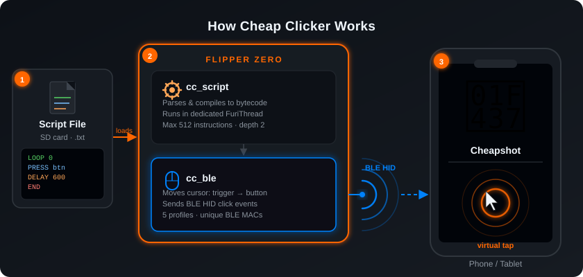
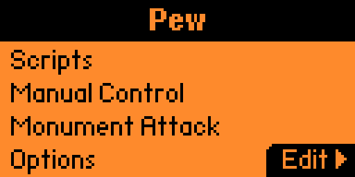
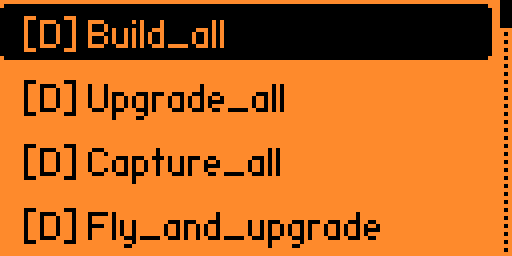
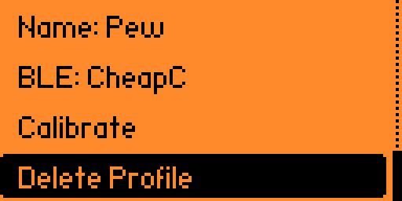
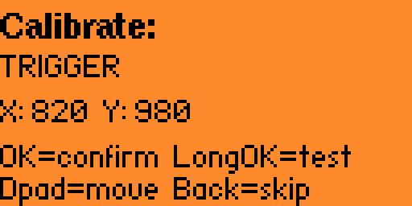
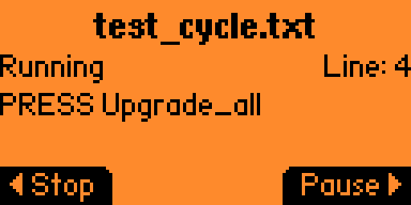
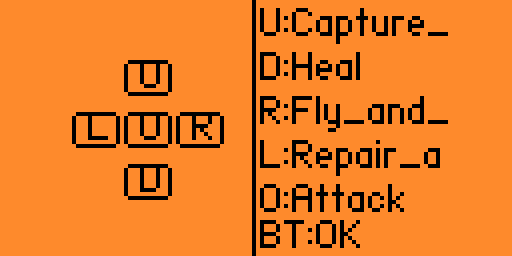
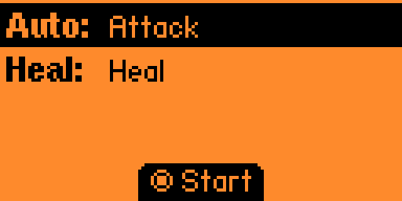
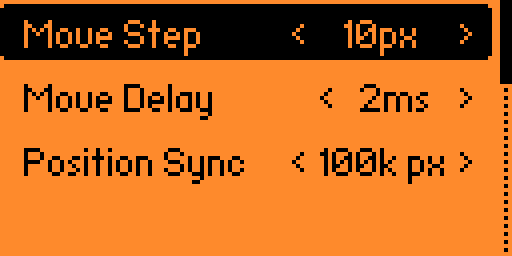

<div align="center">

# 🐷 Cheap Clicker

**A Flipper Zero auto-clicker for the Cheapshot game**

[](https://flipperzero.one)
[](https://en.wikipedia.org/wiki/C_(programming_language))
[](https://github.com/flipperdevices/flipperzero-ufbt)
[](https://github.com/flipperdevices/flipperzero-firmware)
[](LICENSE)
[](https://en.wikipedia.org/wiki/Bluetooth_Low_Energy)

---

*Automate taps in Cheapshot — straight from your Flipper Zero over Bluetooth*

</div>

---

## 📋 Table of Contents

- [About](#-about)
- [Features](#-features)
- [How It Works](#-how-it-works)
- [Quick Start](#-quick-start)
- [Build & Install](#-build--install)
- [Screenshots](#-screenshots)
- [Script Syntax](#-script-syntax)
- [Profile Storage Layout](#-profile-storage-layout)
- [Architecture](#-architecture)
- [Contributing](#-contributing)

---

## 🎯 About

**Cheap Clicker** is a Flipper Zero external app (FAP) that connects to a phone or tablet over Bluetooth and automates taps in the [Cheapshot](https://cheapshot.co/) game. Flipper poses as a Bluetooth HID mouse, moves the virtual cursor, and clicks at calibrated screen coordinates.

No root, no game mods — just honest BLE HID.

---

## ✨ Features

| Feature | Description |
|---------|-------------|
| 🖱️ **BLE HID Mouse** | Flipper emulates a Bluetooth mouse — works with any device out of the box |
| 📱 **Up to 5 profiles** | Each profile is a separate BLE device with its own name and MAC address |
| 🎯 **Calibration** | D-pad cursor control to precisely map button coordinates on screen |
| 📜 **Scripts** | Automation language with loops, delays, and named button presses |
| ⚔️ **Monument Attack** | Dedicated auto-attack mode with heal support |
| 🕹️ **Manual mode** | Map D-pad directions to game buttons for real-time manual control |
| ⚡ **Speed tuning** | Quadratic cursor acceleration model and per-step movement tuning |
| 🔄 **Cursor sync** | Auto cursor reset when position drifts beyond a configurable threshold |

---

## 🔧 How It Works

<div align="center">

</div>

1. A script is loaded from the SD card
2. It is compiled into bytecode (`PRESS` / `DELAY` / `LOOP` instructions)
3. The BLE engine moves the virtual mouse to the trigger point, clicks, moves to the target button, and clicks again
4. Everything runs in a dedicated RTOS thread — the UI stays responsive throughout

---

## 🚀 Quick Start

### 1. Install the app

Copy `cheap_clicker.fap` into the `apps/Tools/` folder on the Flipper SD card.

### 2. Create a profile

Go to **Devices** → **Add device** → enter a name → pair Flipper with your phone as a Bluetooth mouse.

### 3. Calibrate buttons

Open **Buttons** → **Add button** → use the D-pad to move the cursor → press **OK** to save the coordinate.

### 4. Run a script

Drop a `.txt` script onto the SD card under `apps_data/cheap_clicker/scripts/` → open **Scripts** → select the file → press **Run**.

---

## 🔨 Build & Install

### Requirements

- [ufbt](https://github.com/flipperdevices/flipperzero-ufbt) — micro Flipper Build Tool
- Flipper Zero running firmware ≥ 0.86.x

### Commands

```sh
# Build the .fap
ufbt

# Build and deploy to a connected Flipper over USB
ufbt launch

# Clean build artifacts
ufbt -c

# Update the Flipper SDK
ufbt update

# Open a serial CLI session to the Flipper
ufbt cli

# Regenerate VS Code config
ufbt vscode_dist
```

---

## 📸 Screenshots

<div align="center">

| Main Menu | Button List | Profile Edit | Calibration |
|:---------:|:-----------:|:------------:|:-----------:|
|  |  |  |  |
| **Script Running** | **Manual Control** | **Monument Attack** | **Options** |
|  |  |  |  |

</div>

---

## 📜 Script Syntax

Scripts are plain `.txt` files stored on the SD card. One instruction per line.

```
# This is a comment

PRESS <button_name>    # Click a named button from the active profile
DELAY <ms>             # Wait N milliseconds
LOOP <n>               # Repeat n times (0 = infinite)
END                    # End of a LOOP body
```

### Example: game loop

```
LOOP 0
    PRESS build_all
    DELAY 600
    LOOP 10
        PRESS upgrade_all
        DELAY 600
    END
    PRESS capture_all
    DELAY 600
    PRESS fly_and_upgrade
    DELAY 600
END
```

**Limits:**
- Max 512 instructions per script
- Max `LOOP` nesting depth: 2
- Button names are case-sensitive

---

## 🗂️ Profile Storage Layout

All data lives on the SD card:

```
/ext/apps_data/cheap_clicker/
├── config.fds              ← active profile index
├── profiles/
│   ├── p0/
│   │   ├── profile.fds     ← name, BLE name, trigger coords, button count
│   │   ├── buttons.fds     ← button names and x/y coordinates
│   │   └── bt.keys         ← BLE pairing keys (absent = not paired)
│   ├── p1/
│   └── ...
└── scripts/
    ├── my_script.txt
    └── ...
```

- Up to **5 profiles** — each with a unique BLE MAC (derived via XOR with the slot index)
- Up to **17 buttons** per profile
- Names up to **32 characters**, BLE device names up to **29 characters**

---

## 🏗️ Architecture

```
cheap_clicker.c          ← entry point, main app loop
cheap_clicker_i.h        ← CheapClickerApp root state struct
│
├── scenes/              ← Scene Manager scenes
│   ├── cc_scene_start       Main screen
│   ├── cc_scene_profiles    Profile list
│   ├── cc_scene_calibrate   Cursor calibration
│   ├── cc_scene_run         Script execution
│   ├── cc_scene_monument    Monument Attack
│   └── ...
│
├── views/               ← custom View implementations
│   ├── cc_start_view        Main screen
│   ├── cc_calibrate_view    D-pad cursor control
│   ├── cc_run_view          Script execution status
│   ├── cc_monument_view     Monument Attack status
│   └── cc_manual_view       Manual button mapping
│
└── helpers/             ← business logic
    ├── cc_ble.c         BLE HID mouse, cursor movement
    ├── cc_profile.c     Profile load/save to SD
    ├── cc_script.c      Script compiler and executor (FuriThread)
    ├── cc_monument.c    Monument Attack automation
    └── cc_manual.c      Manual mode button mapping
```

### Key design decisions

- **BLE HID Mouse** instead of screen touch injection — works on any device without root
- **Dedicated FuriThread** for script execution — UI never freezes
- **Mutex-protected** script status — safe reads from the UI thread
- **Bytecode compilation** instead of runtime string parsing — predictable per-tick latency

---

## 🤝 Contributing

Issues and pull requests are welcome!

**Code style:** 4-space indent, 99-column limit (`.clang-format` included). All functions are prefixed with `cc_`.

---

<div align="center">

Built with ❤️ for Flipper Zero

[](https://flipperzero.one)
[](https://en.wikipedia.org/wiki/C_(programming_language))

</div>
